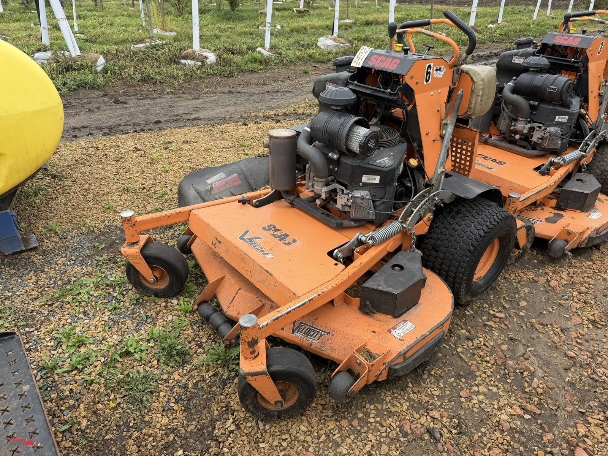
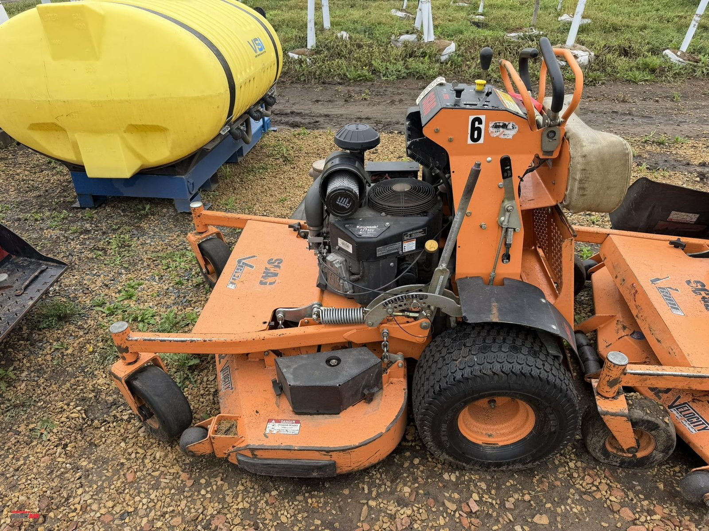
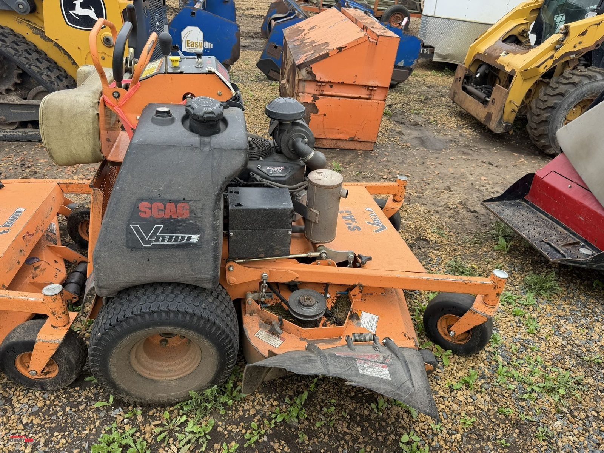
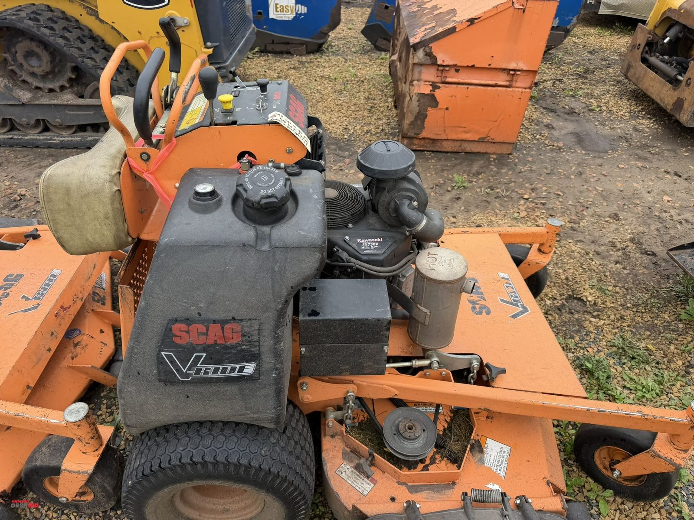
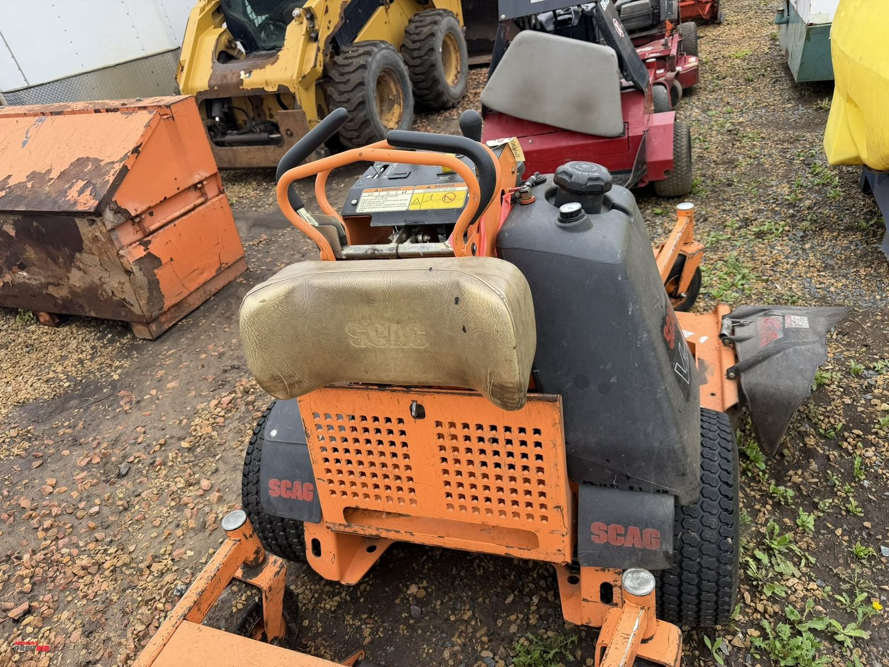
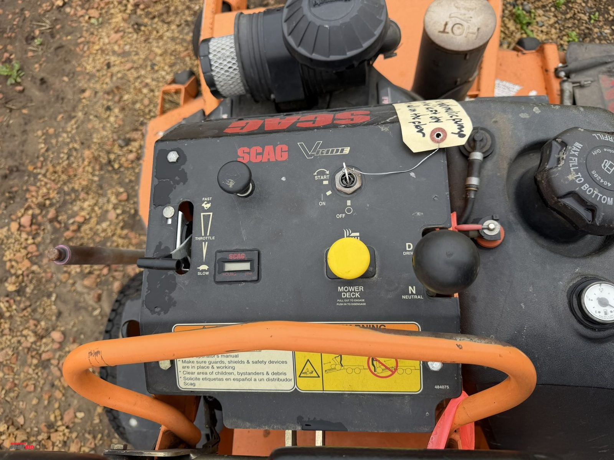
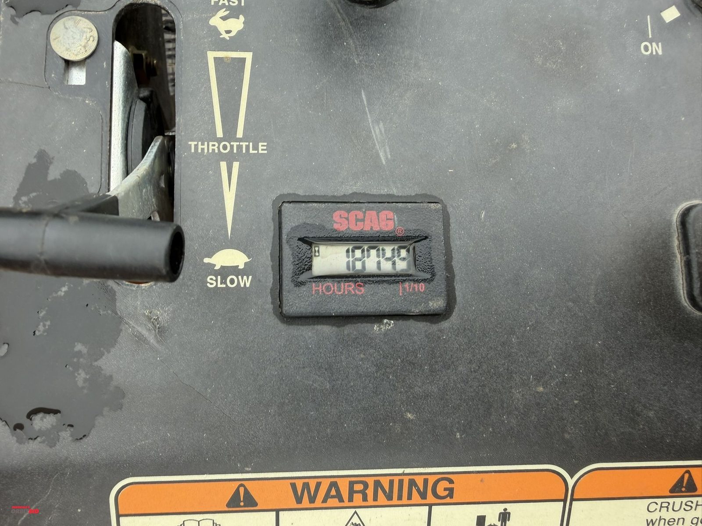
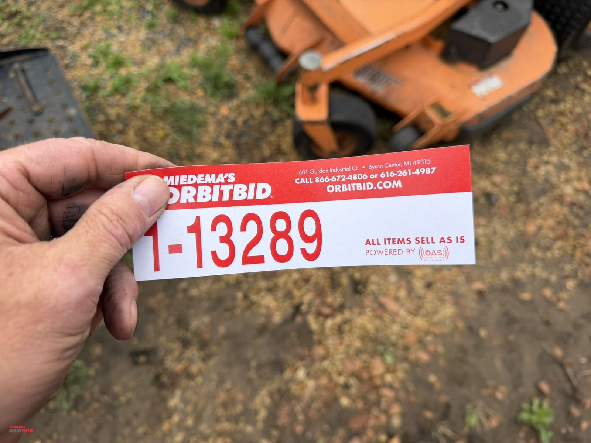

# Lot 13289

(1) Scag V-ride, walk-behind mower, 52" deck, 1874 hours showing, runs, but does not currently able ...

- Snapshot bid: $5
- Bid count: 0
- Mirrored photos: 8

## Photo 1

[Original OrbitBid image](https://d1ljvnrgb7j023.cloudfront.net/files/1/b23fe183b2b99874b187/large)

## Photo 2

[Original OrbitBid image](https://d1ljvnrgb7j023.cloudfront.net/files/1/37efe781fedad5a7b5cd/large)

## Photo 3

[Original OrbitBid image](https://d1ljvnrgb7j023.cloudfront.net/files/1/e27b7206fb9a9e6d4e79/large)

## Photo 4

[Original OrbitBid image](https://d1ljvnrgb7j023.cloudfront.net/files/1/704cfb875a9d22251700/large)

## Photo 5

[Original OrbitBid image](https://d1ljvnrgb7j023.cloudfront.net/files/1/d5544e6f15149534227c/large)

## Photo 6

[Original OrbitBid image](https://d1ljvnrgb7j023.cloudfront.net/files/1/760d37eaa750f91c5388/large)

## Photo 7

[Original OrbitBid image](https://d1ljvnrgb7j023.cloudfront.net/files/1/6a58d0fe32752a5cddb5/large)

## Photo 8

[Original OrbitBid image](https://d1ljvnrgb7j023.cloudfront.net/files/1/6f80d7be33960dda82fc/large)
