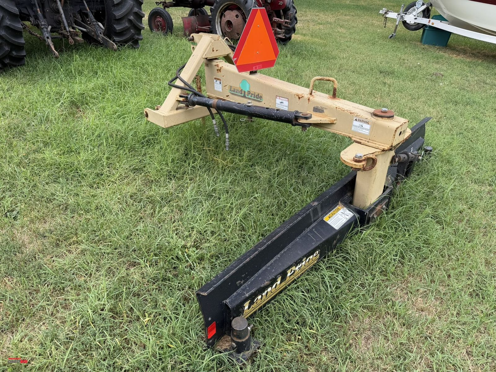
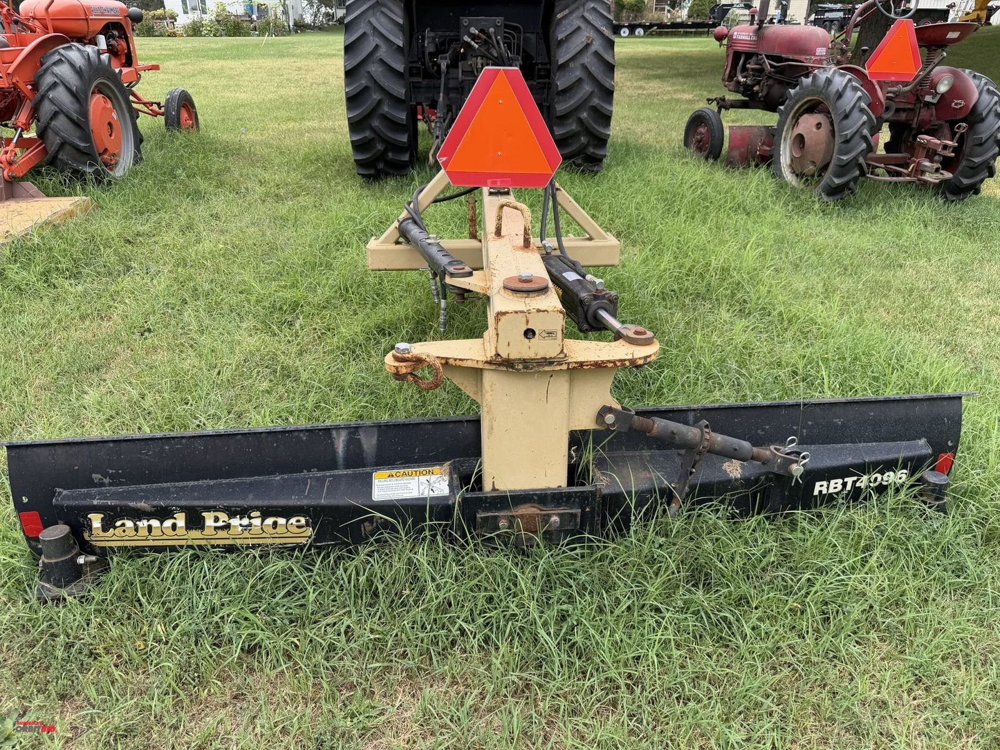
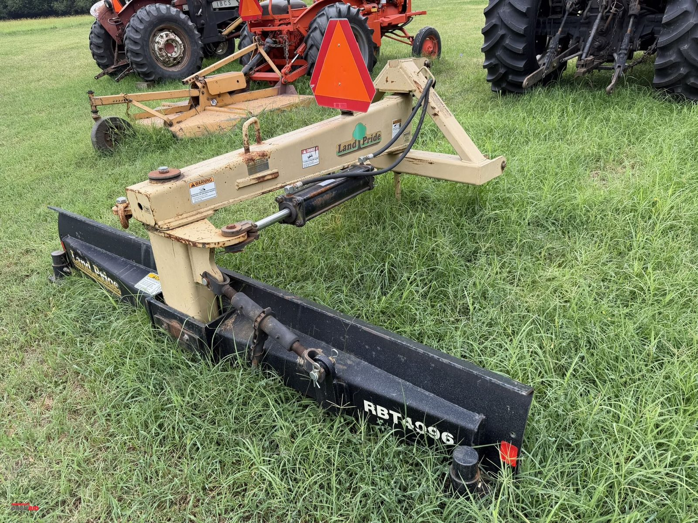
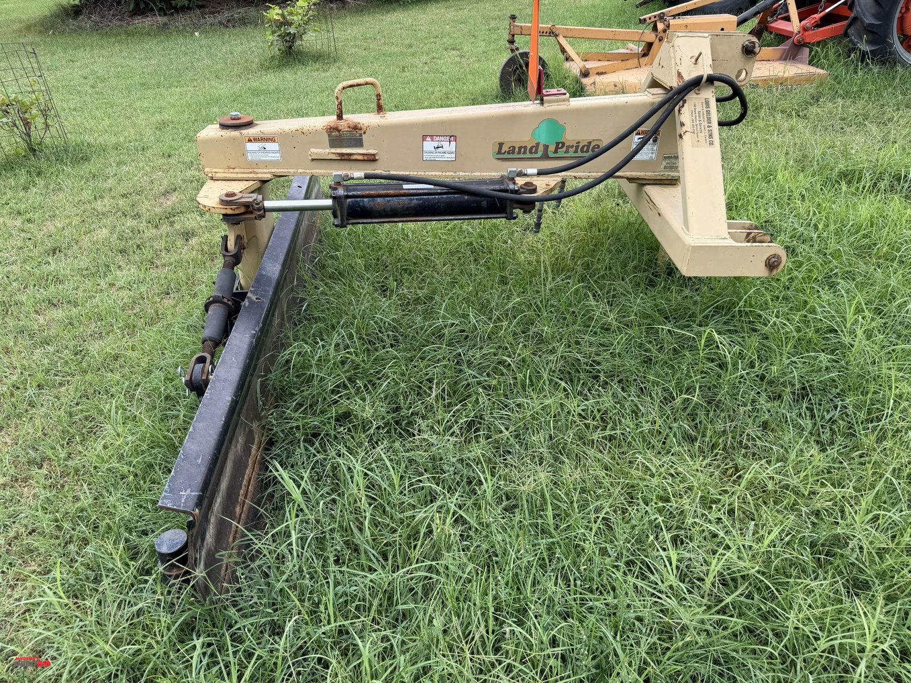
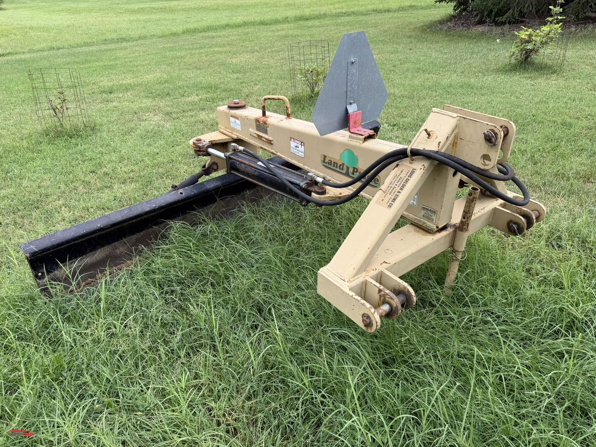
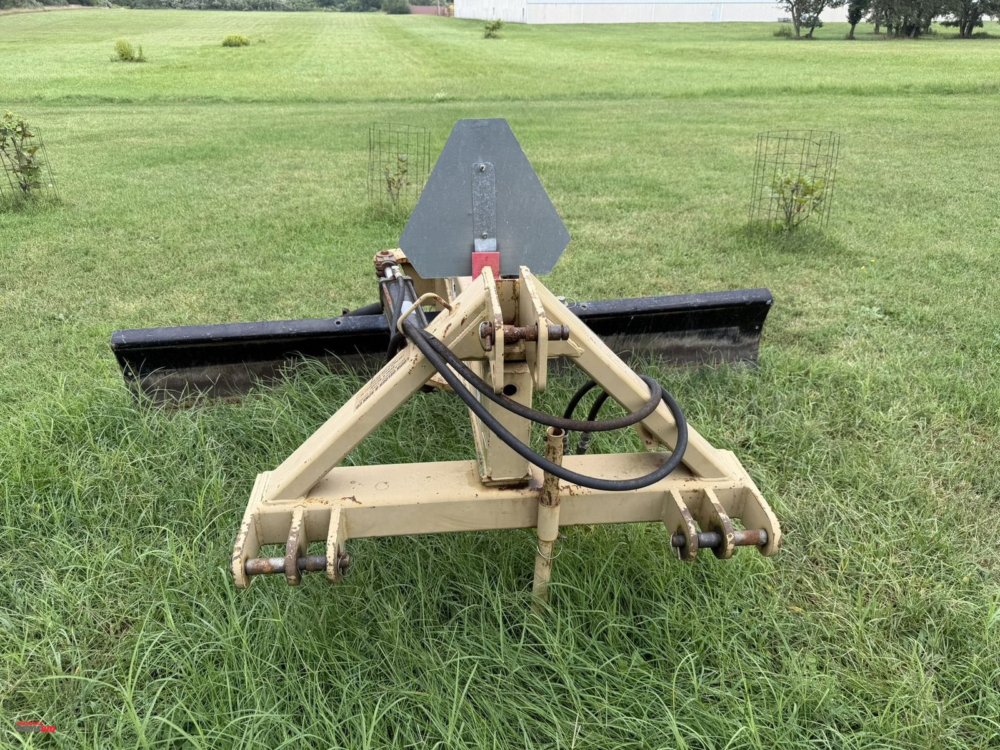
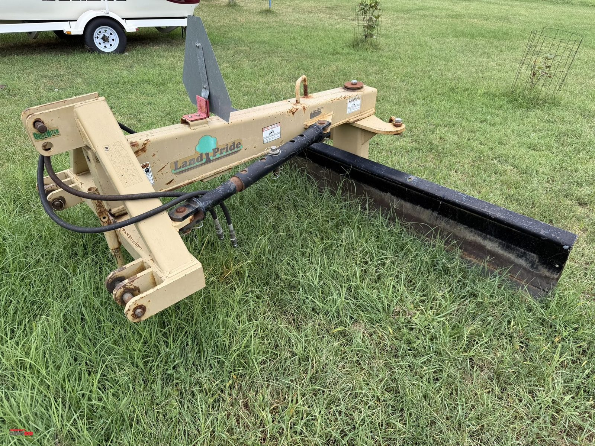
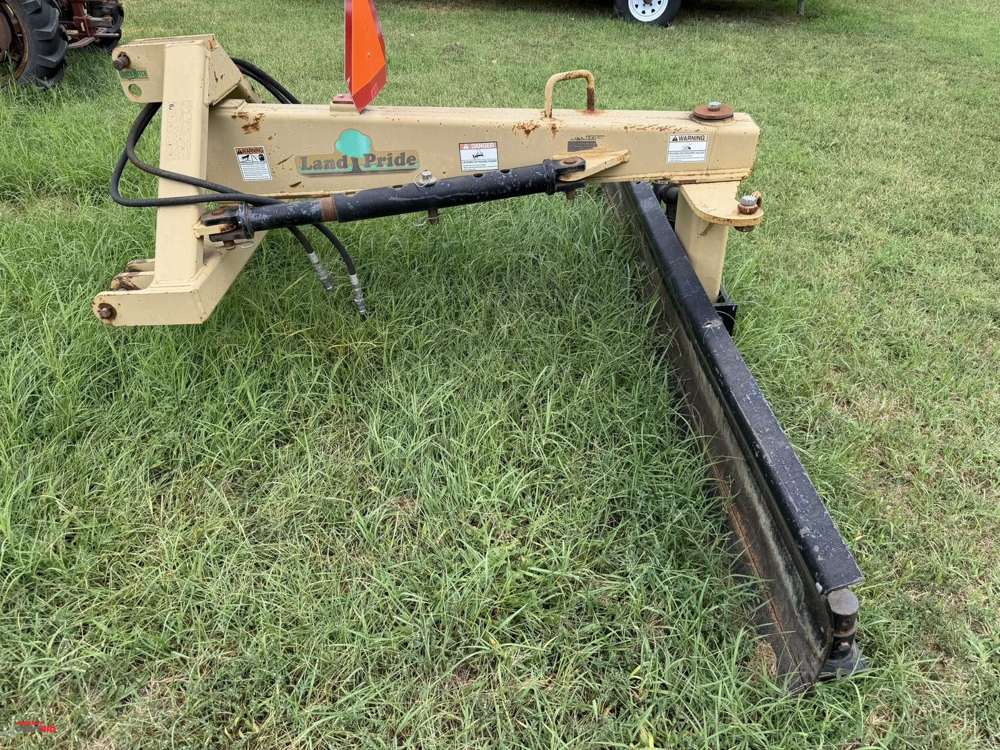
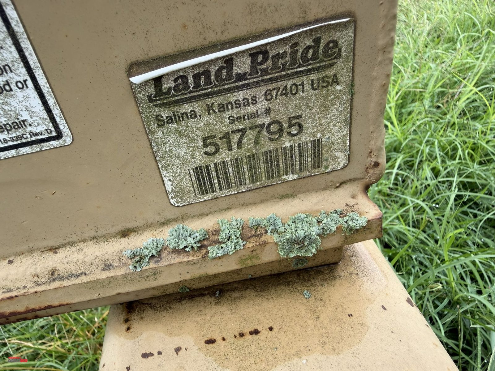
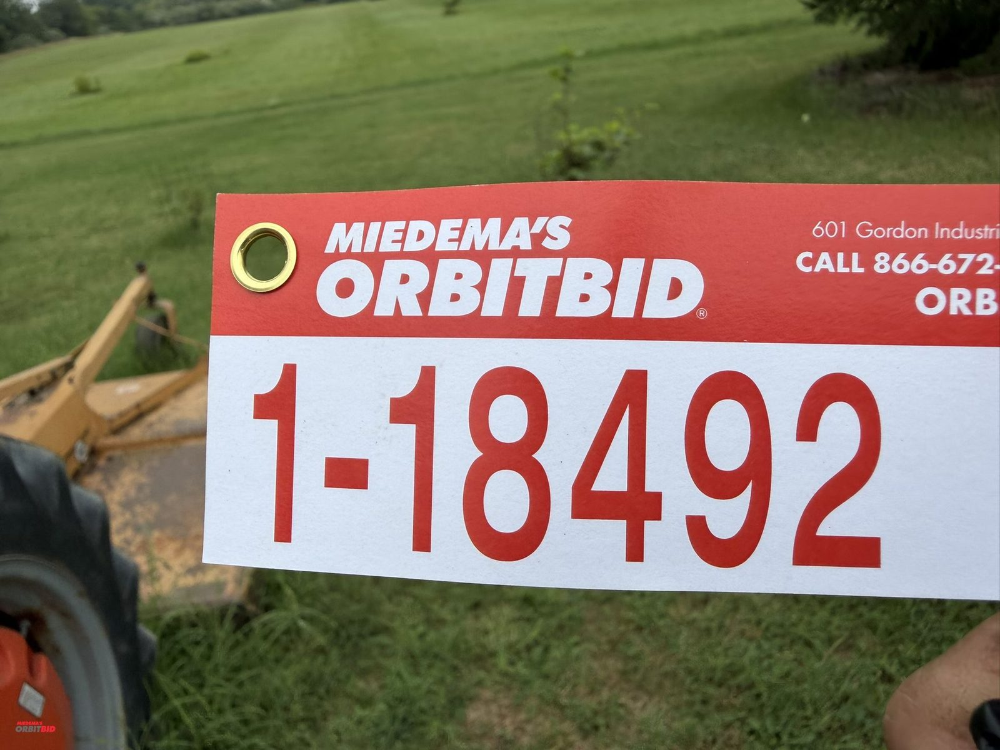

# Lot 18492

(1) Land Pride, model RBT4096, 8', 3 pt., hydraulic operated rear grading/scraper blade, S/N 517795.

- Snapshot bid: $5
- Bid count: 0
- Mirrored photos: 10

## Photo 1

[Original OrbitBid image](https://d1ljvnrgb7j023.cloudfront.net/files/1/9342b13f4417bed31557/large)

## Photo 2

[Original OrbitBid image](https://d1ljvnrgb7j023.cloudfront.net/files/1/8ca3061b70150da074ac/large)

## Photo 3

[Original OrbitBid image](https://d1ljvnrgb7j023.cloudfront.net/files/1/538d4c8a1eea640d2b83/large)

## Photo 4

[Original OrbitBid image](https://d1ljvnrgb7j023.cloudfront.net/files/1/73eccdf7a1aef5e254a5/large)

## Photo 5

[Original OrbitBid image](https://d1ljvnrgb7j023.cloudfront.net/files/1/e6d3efcccc952a95a52e/large)

## Photo 6

[Original OrbitBid image](https://d1ljvnrgb7j023.cloudfront.net/files/1/4c5e3265dd0753bb3af9/large)

## Photo 7

[Original OrbitBid image](https://d1ljvnrgb7j023.cloudfront.net/files/1/59d8d891388f002f668a/large)

## Photo 8

[Original OrbitBid image](https://d1ljvnrgb7j023.cloudfront.net/files/1/7e2f6bfe27ebd6d24611/large)

## Photo 9

[Original OrbitBid image](https://d1ljvnrgb7j023.cloudfront.net/files/1/c535f253c07572e80778/large)

## Photo 10

[Original OrbitBid image](https://d1ljvnrgb7j023.cloudfront.net/files/1/81ef041c7f691ee83071/large)
