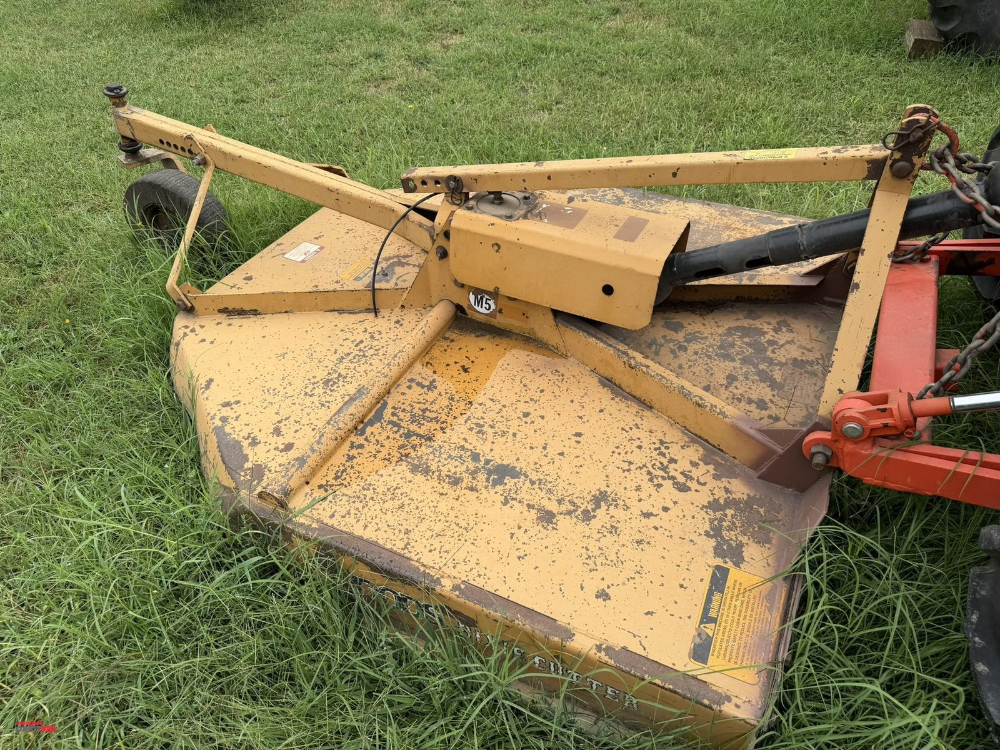
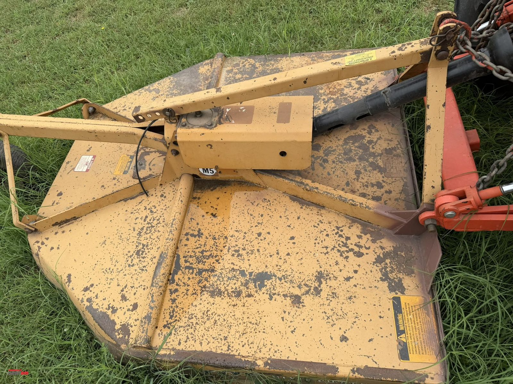
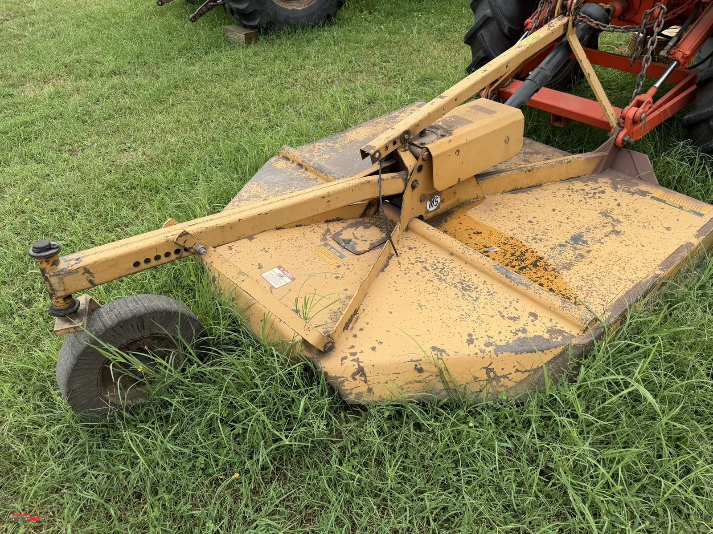
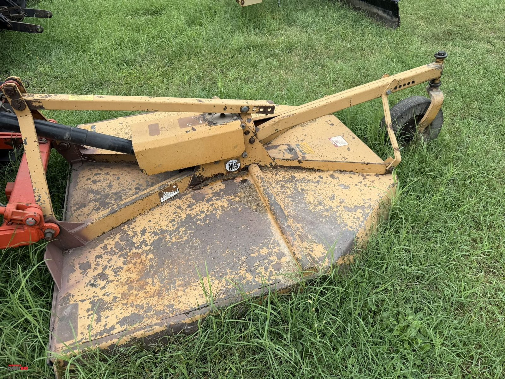
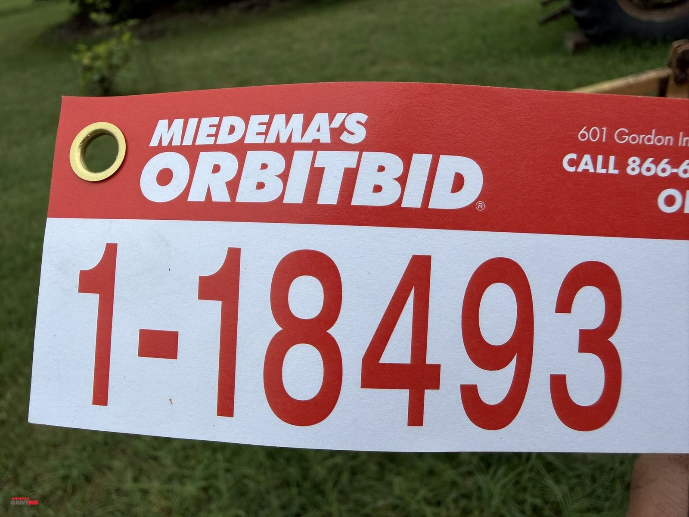

# Lot 18493

(1) Woods, model M5, 5' shaft driven, 3 pt., Dixie cutter, rotary cutter/brush hog, with rear tail w...

- Snapshot bid: $5
- Bid count: 0
- Mirrored photos: 5

## Photo 1

[Original OrbitBid image](https://d1ljvnrgb7j023.cloudfront.net/files/1/549a48d9c3f2aca43f7e/large)

## Photo 2

[Original OrbitBid image](https://d1ljvnrgb7j023.cloudfront.net/files/1/b7be551ef751b59197c1/large)

## Photo 3

[Original OrbitBid image](https://d1ljvnrgb7j023.cloudfront.net/files/1/f632bf4803fe26354421/large)

## Photo 4

[Original OrbitBid image](https://d1ljvnrgb7j023.cloudfront.net/files/1/f08bdbf8c99df48e0483/large)

## Photo 5

[Original OrbitBid image](https://d1ljvnrgb7j023.cloudfront.net/files/1/2a80833d9a9807bdec7a/large)
