# Lot 32

Electrical: 460V / 3-Phase / 60Hz, Min. Circuit Ampacity 16A, Max. Protective Device Rating 20A Max...

- Snapshot bid: $55
- Bid count: 5
- Mirrored photos: 11

## Photo 1

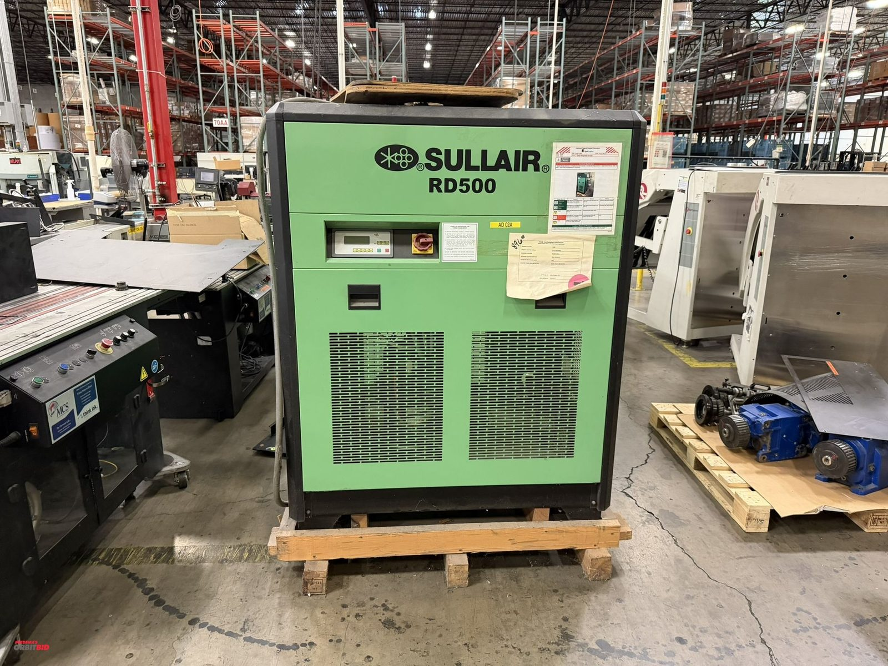

[Original OrbitBid image](https://d1ljvnrgb7j023.cloudfront.net/files/1/75c1c95ae8ce5f9a6bf3/large)

## Photo 2

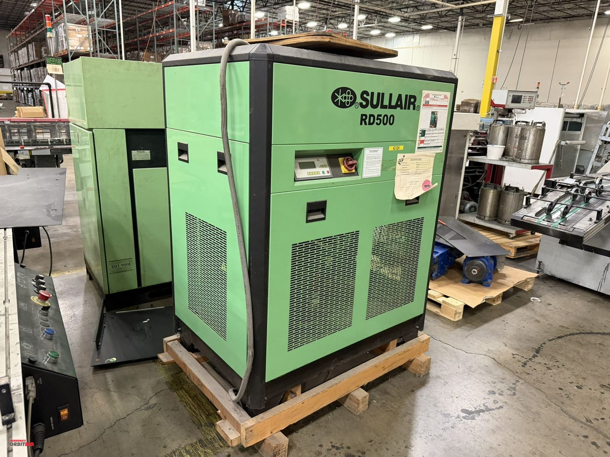

[Original OrbitBid image](https://d1ljvnrgb7j023.cloudfront.net/files/1/b2ac3b95731e8b0edb71/large)

## Photo 3

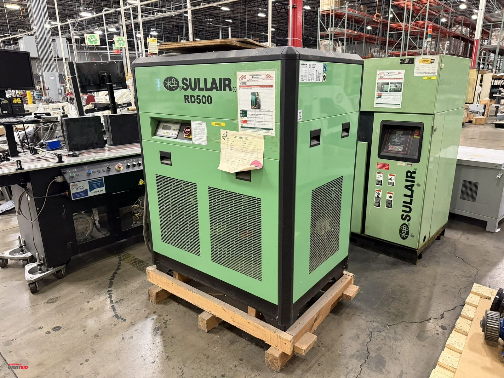

[Original OrbitBid image](https://d1ljvnrgb7j023.cloudfront.net/files/1/f074e5c60b600761f6b6/large)

## Photo 4

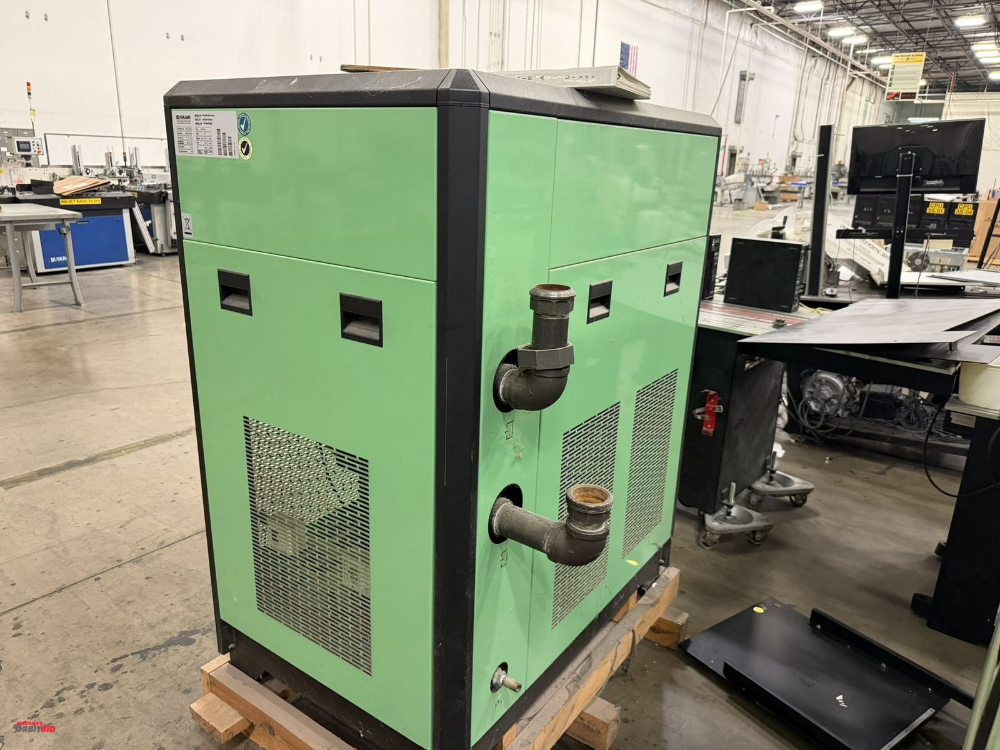

[Original OrbitBid image](https://d1ljvnrgb7j023.cloudfront.net/files/1/dd8fb1df4c851779162d/large)

## Photo 5

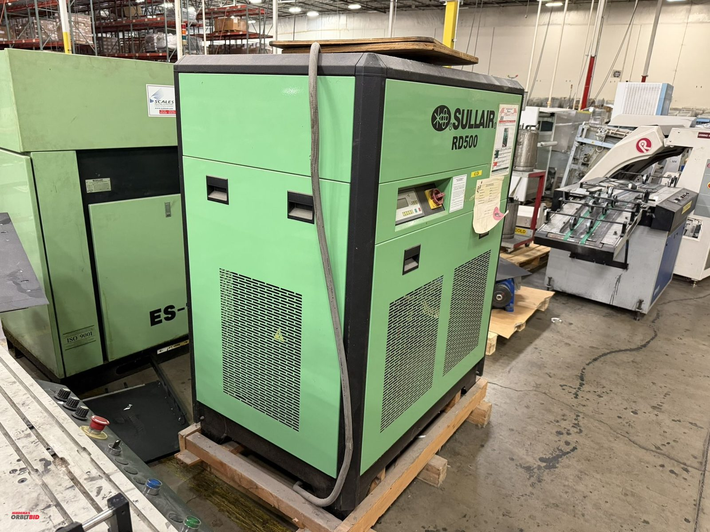

[Original OrbitBid image](https://d1ljvnrgb7j023.cloudfront.net/files/1/4924b79667fa8861989c/large)

## Photo 6

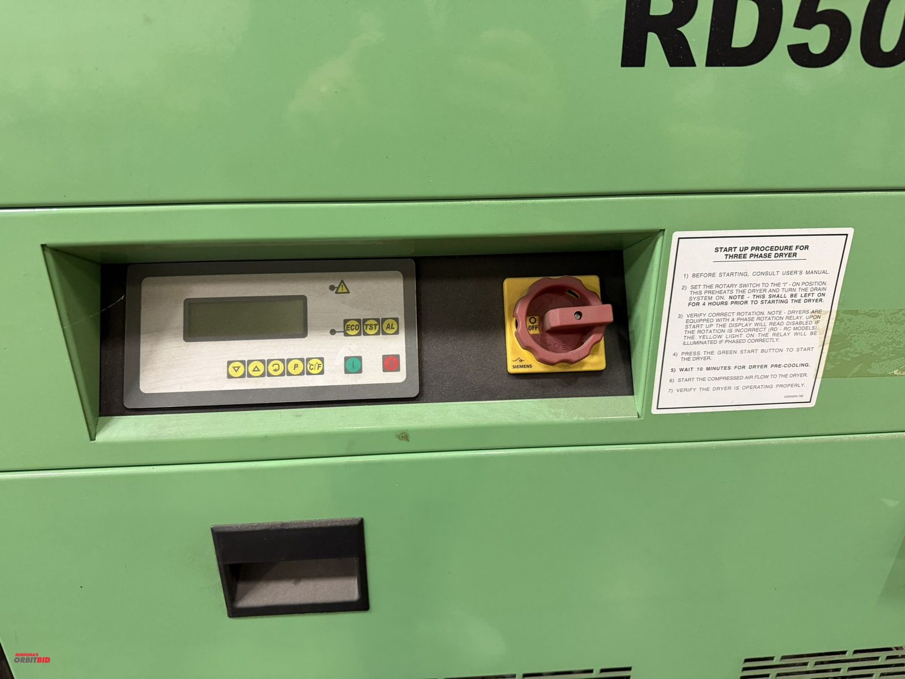

[Original OrbitBid image](https://d1ljvnrgb7j023.cloudfront.net/files/1/ffb38eec22f7c5381ee1/large)

## Photo 7

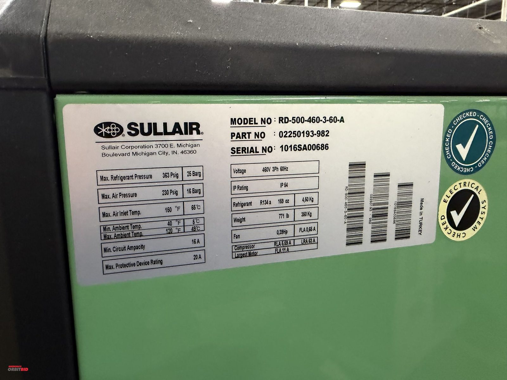

[Original OrbitBid image](https://d1ljvnrgb7j023.cloudfront.net/files/1/25e6841958ad49694151/large)

## Photo 8

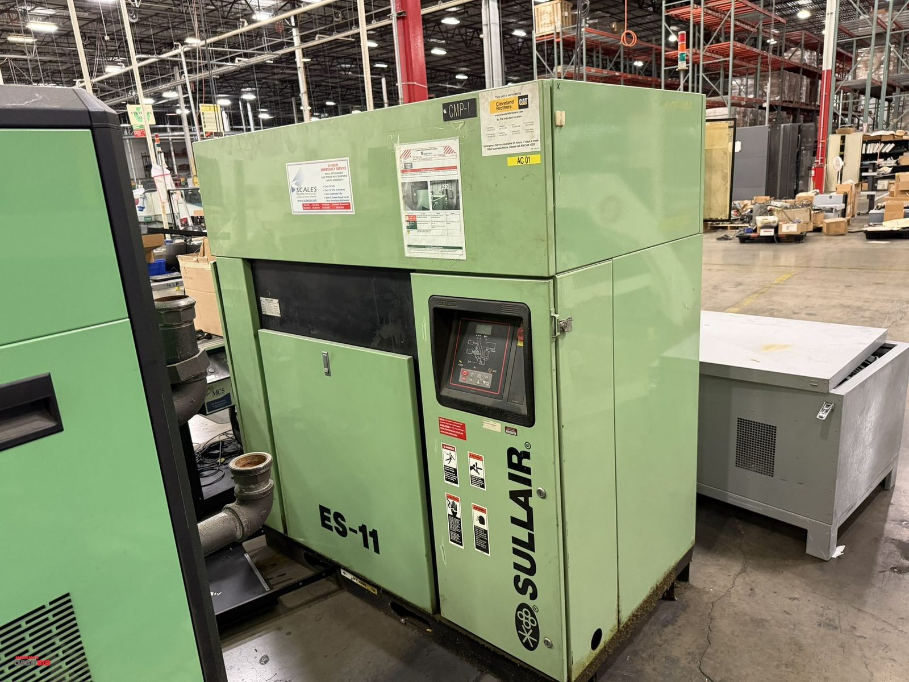

[Original OrbitBid image](https://d1ljvnrgb7j023.cloudfront.net/files/1/82f4200ff1528f6c6170/large)

## Photo 9

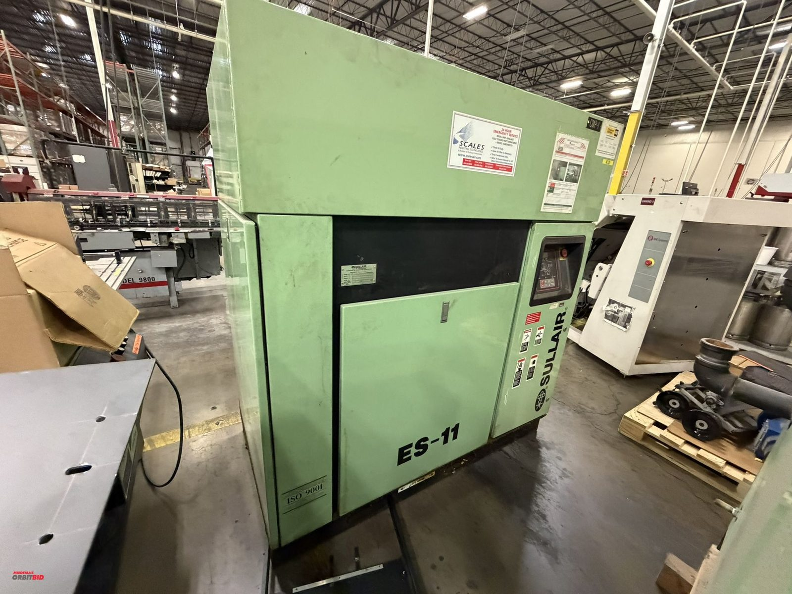

[Original OrbitBid image](https://d1ljvnrgb7j023.cloudfront.net/files/1/3b848488c5950c86b4b3/large)

## Photo 10

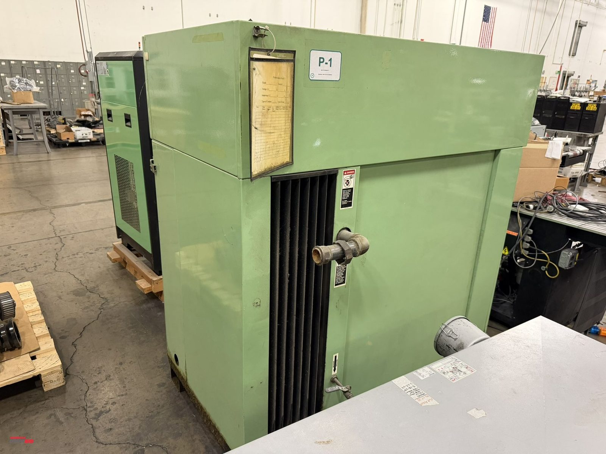

[Original OrbitBid image](https://d1ljvnrgb7j023.cloudfront.net/files/1/7679d04ffa502d70a0d8/large)

## Photo 11

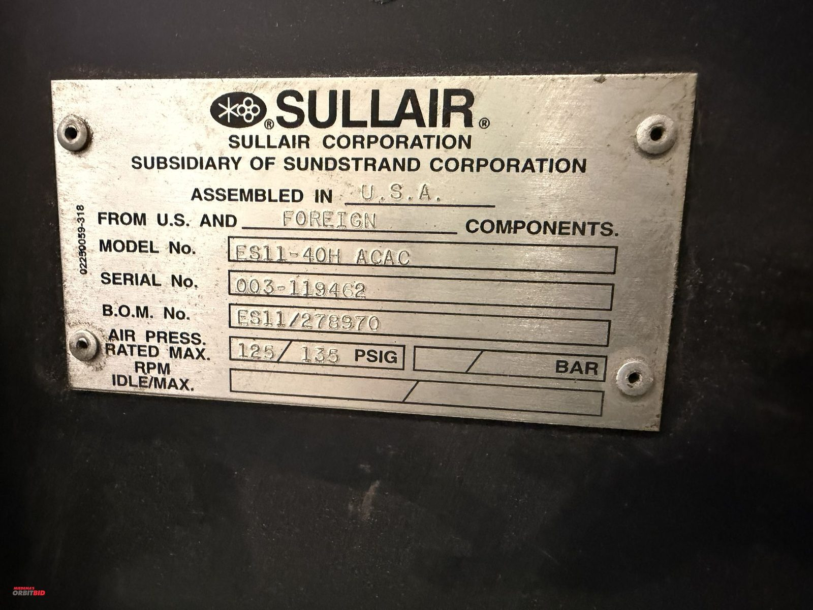

[Original OrbitBid image](https://d1ljvnrgb7j023.cloudfront.net/files/1/ef6258cb47b3b31df357/large)
