# Lot 9915

(1) Bradford Industries gravity wagon, model 220 deluxe, extendable tongue, bin extensions, SN 19219...

- Snapshot bid: $50
- Bid count: 0
- Mirrored photos: 13

## Photo 1

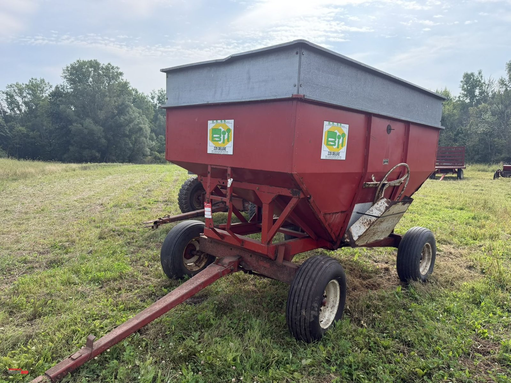

[Original OrbitBid image](https://d1ljvnrgb7j023.cloudfront.net/files/1/742daebf753b3a55ee05/large)

## Photo 2

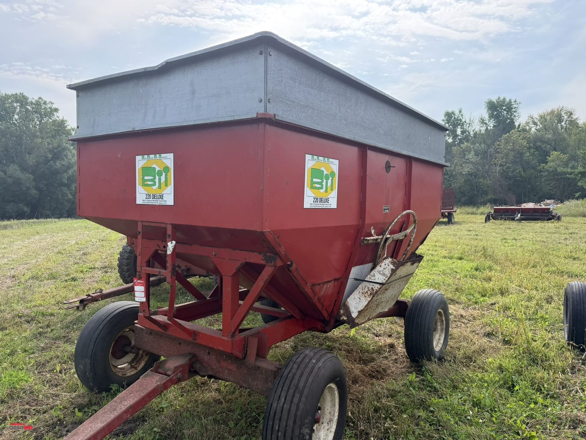

[Original OrbitBid image](https://d1ljvnrgb7j023.cloudfront.net/files/1/c0b083740b46a7db01d2/large)

## Photo 3

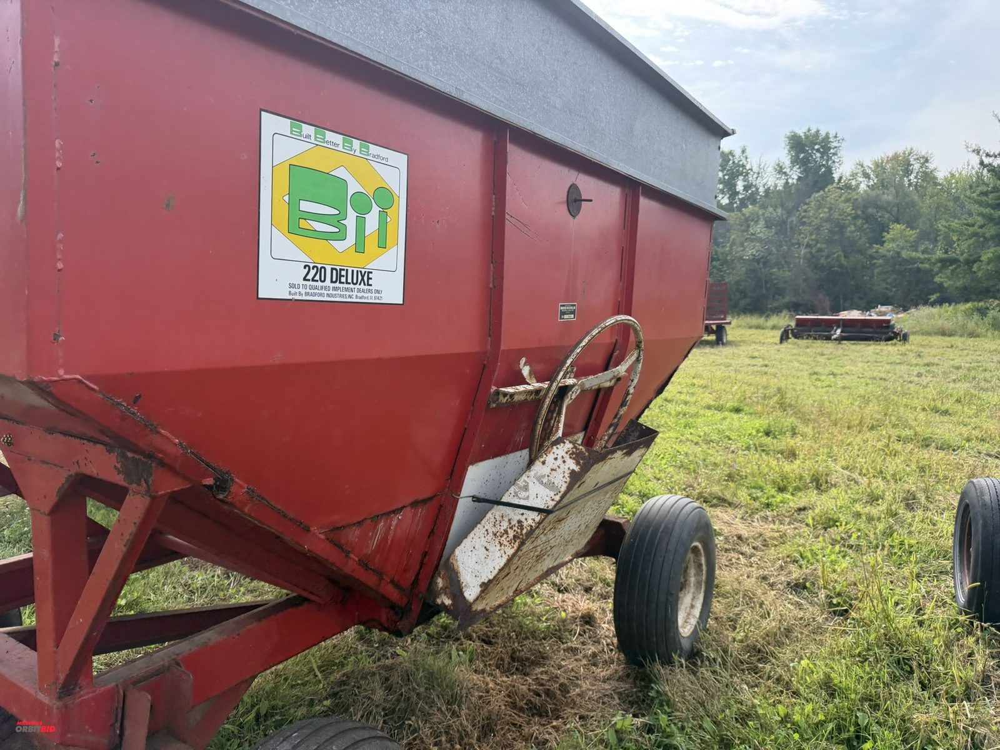

[Original OrbitBid image](https://d1ljvnrgb7j023.cloudfront.net/files/1/45821c752e6f283c7391/large)

## Photo 4

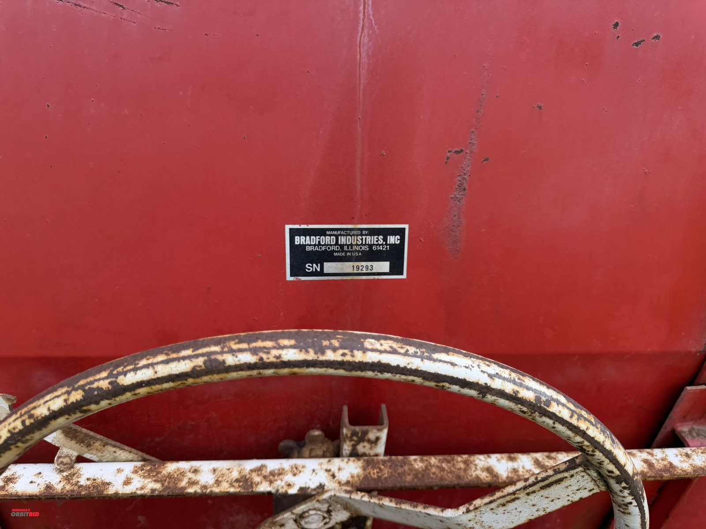

[Original OrbitBid image](https://d1ljvnrgb7j023.cloudfront.net/files/1/693c8d4fad9e7e4e477a/large)

## Photo 5

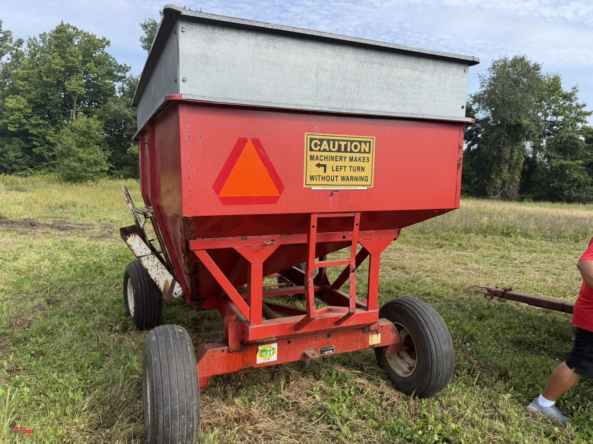

[Original OrbitBid image](https://d1ljvnrgb7j023.cloudfront.net/files/1/0c055eb3ef656a16ba91/large)

## Photo 6

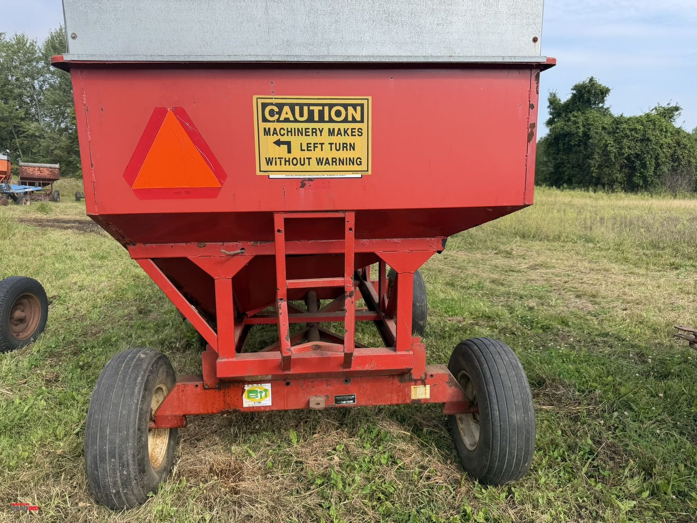

[Original OrbitBid image](https://d1ljvnrgb7j023.cloudfront.net/files/1/2ca16f5199df69db7ffa/large)

## Photo 7

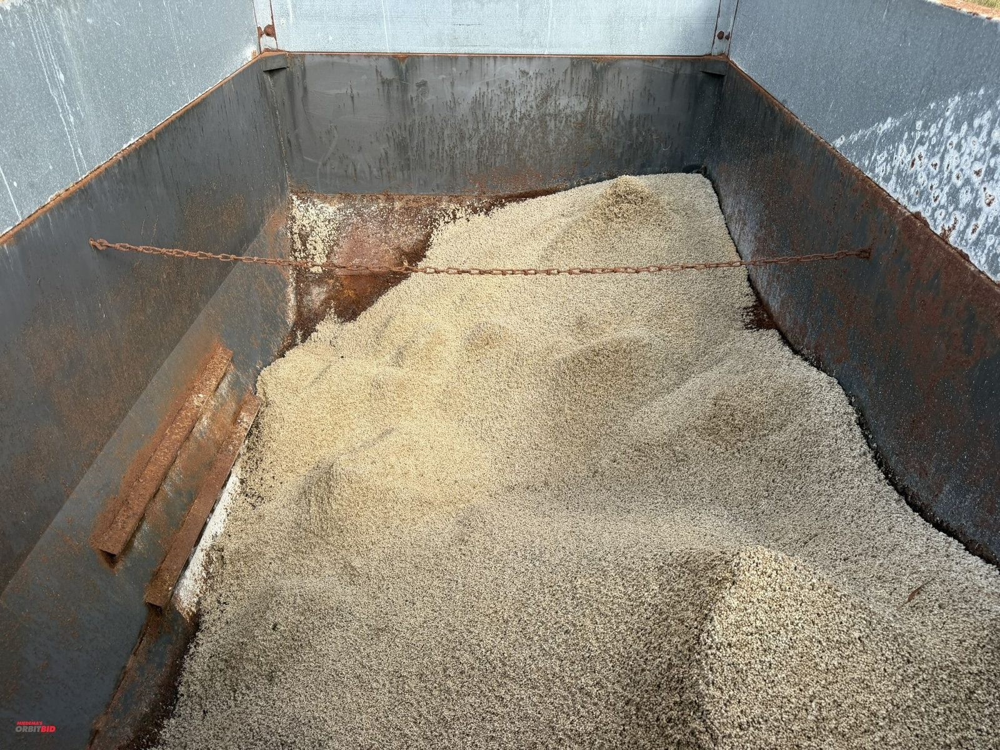

[Original OrbitBid image](https://d1ljvnrgb7j023.cloudfront.net/files/1/e349a075cc8217f76994/large)

## Photo 8

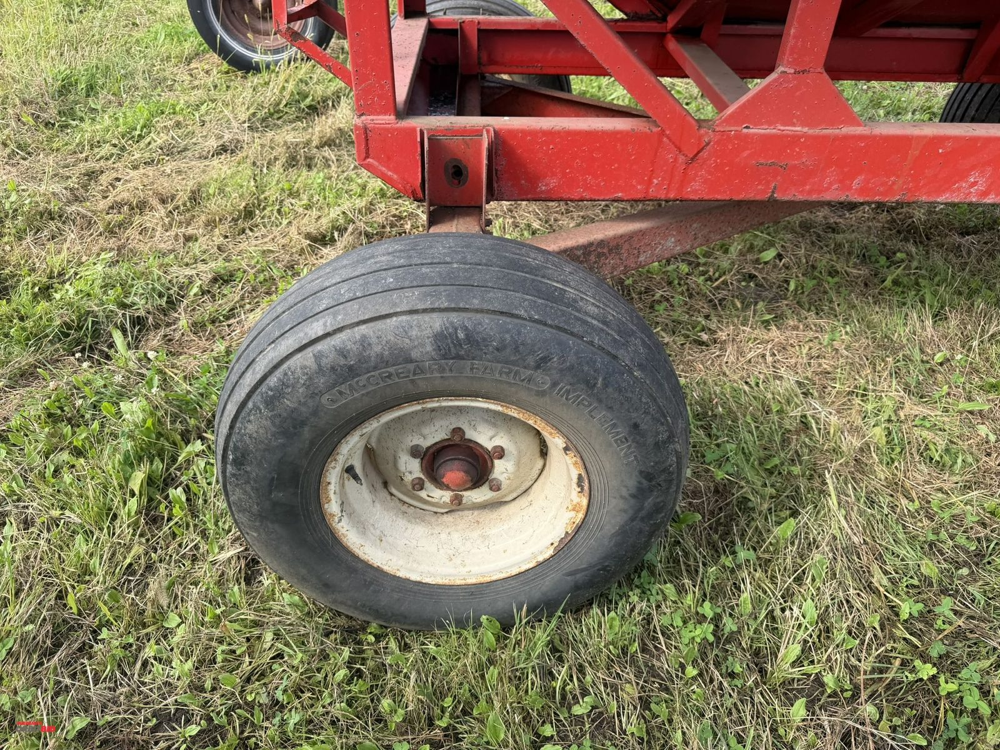

[Original OrbitBid image](https://d1ljvnrgb7j023.cloudfront.net/files/1/bd6e2558eea11378085e/large)

## Photo 9

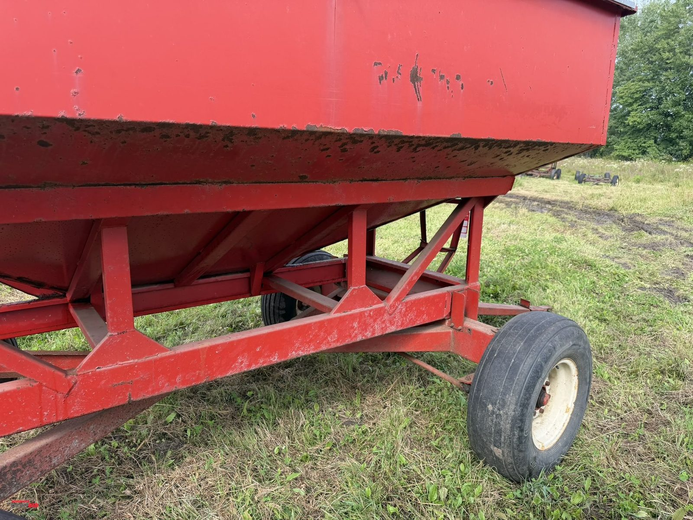

[Original OrbitBid image](https://d1ljvnrgb7j023.cloudfront.net/files/1/6f85ad62eedaa26aca21/large)

## Photo 10

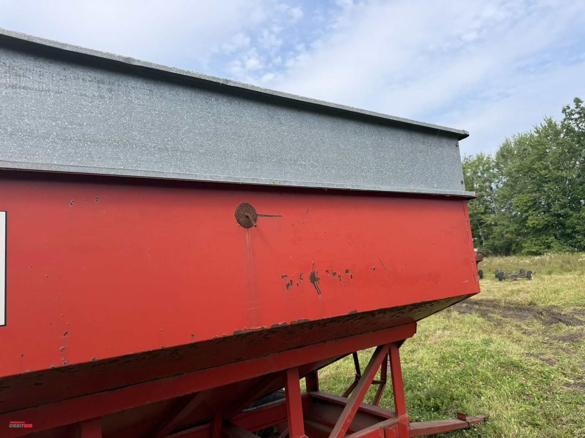

[Original OrbitBid image](https://d1ljvnrgb7j023.cloudfront.net/files/1/f27d40b82f540f29a160/large)

## Photo 11

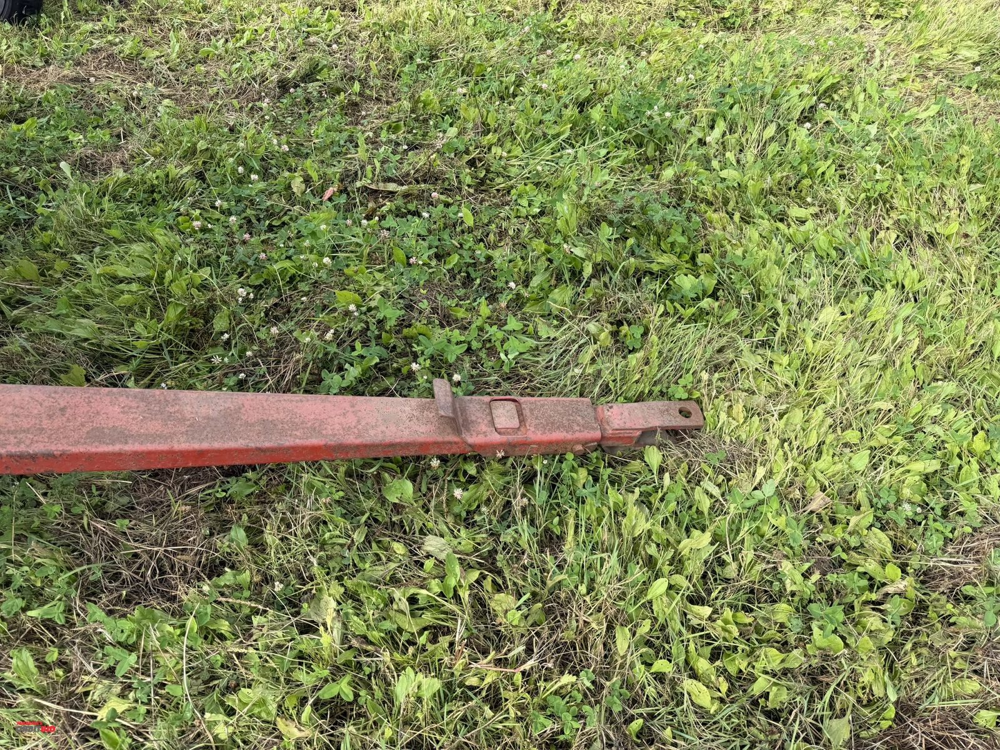

[Original OrbitBid image](https://d1ljvnrgb7j023.cloudfront.net/files/1/f147e85af81ed3a9321c/large)

## Photo 12

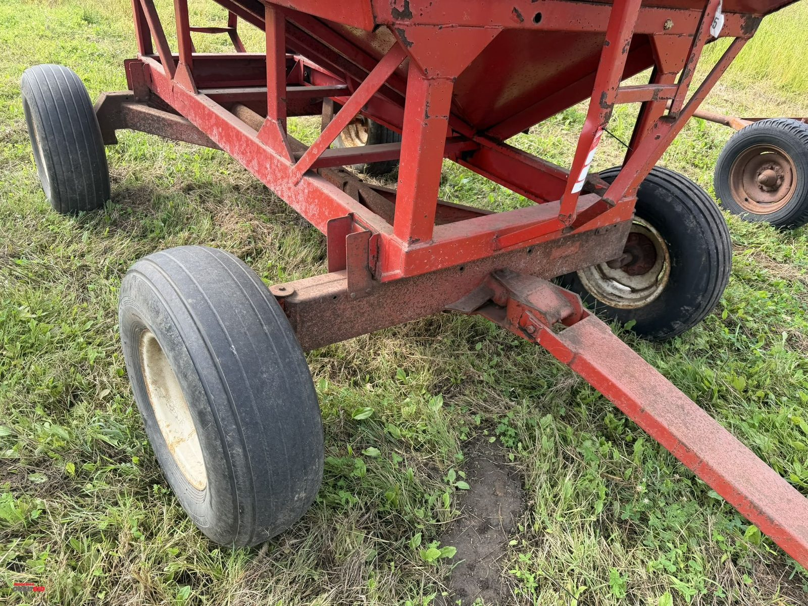

[Original OrbitBid image](https://d1ljvnrgb7j023.cloudfront.net/files/1/3689575dd0f52d848ccb/large)

## Photo 13

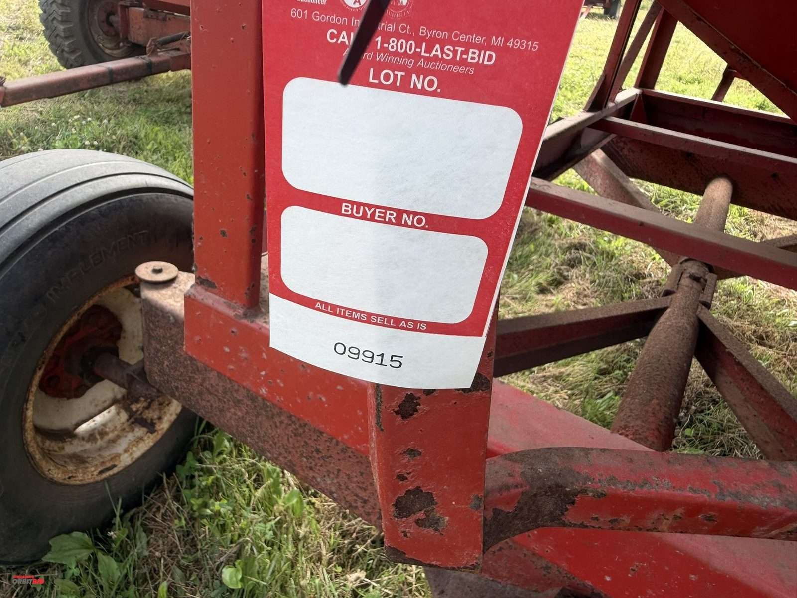

[Original OrbitBid image](https://d1ljvnrgb7j023.cloudfront.net/files/1/9e1adfb6537a657d160f/large)
