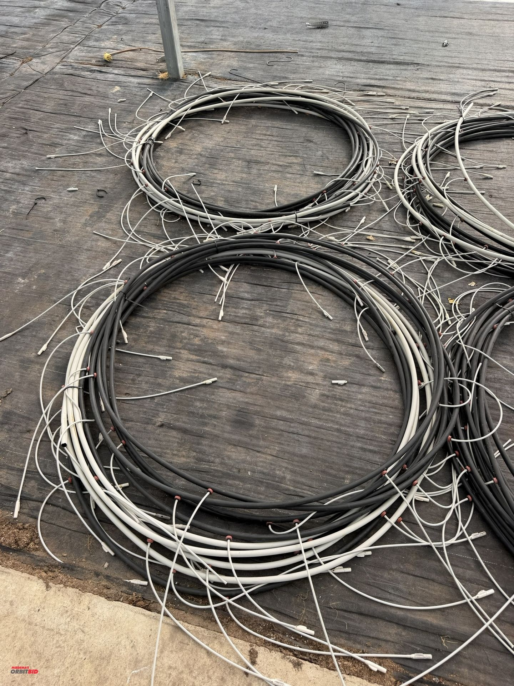
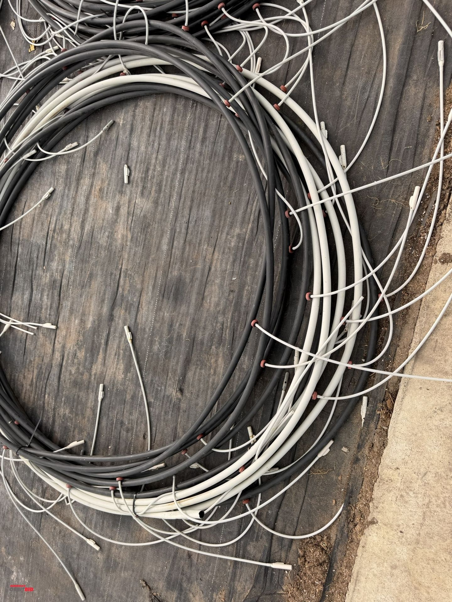
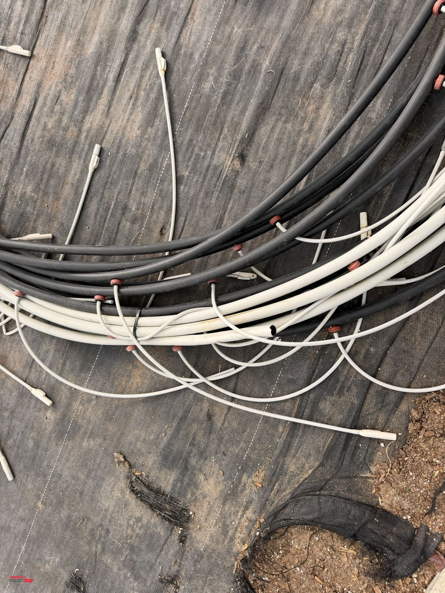
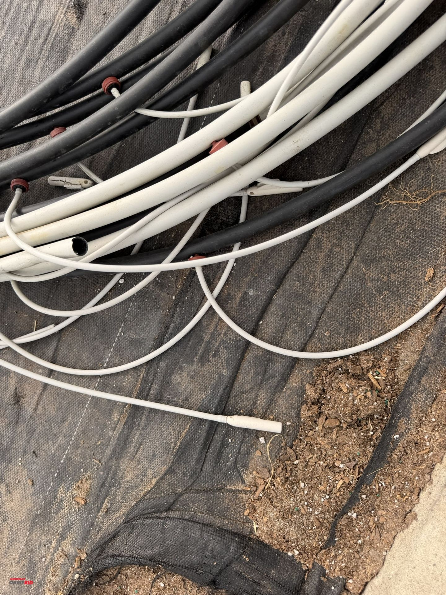
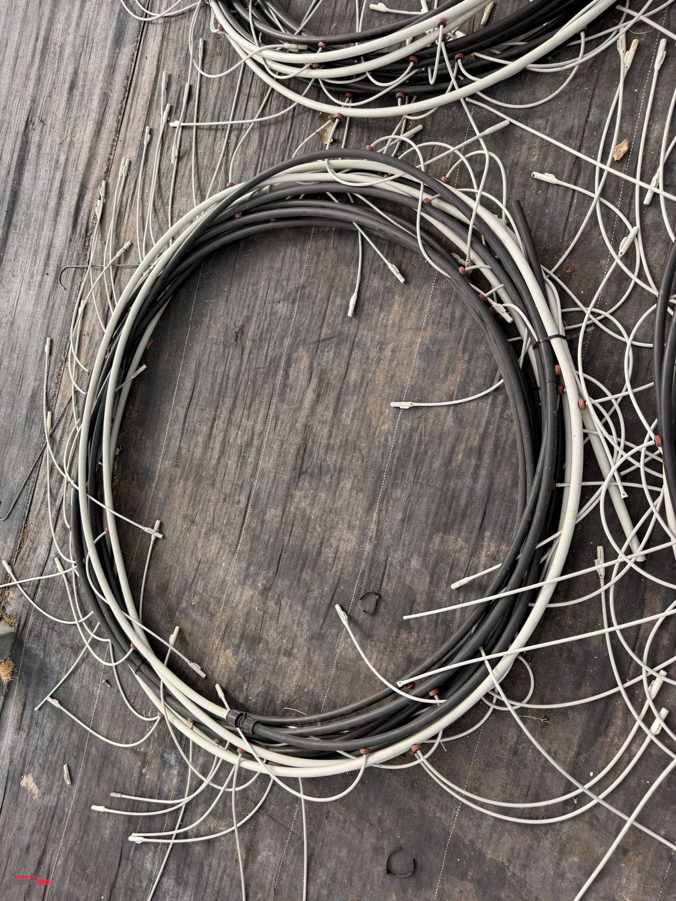
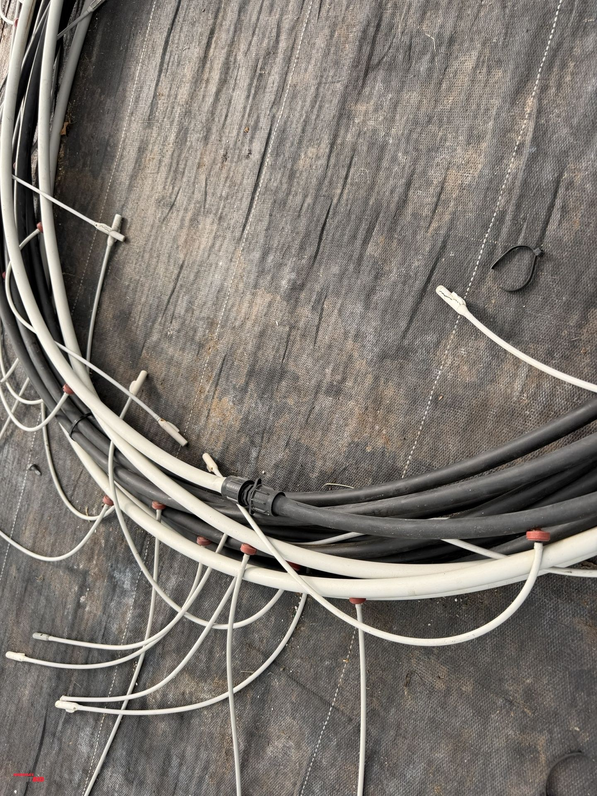
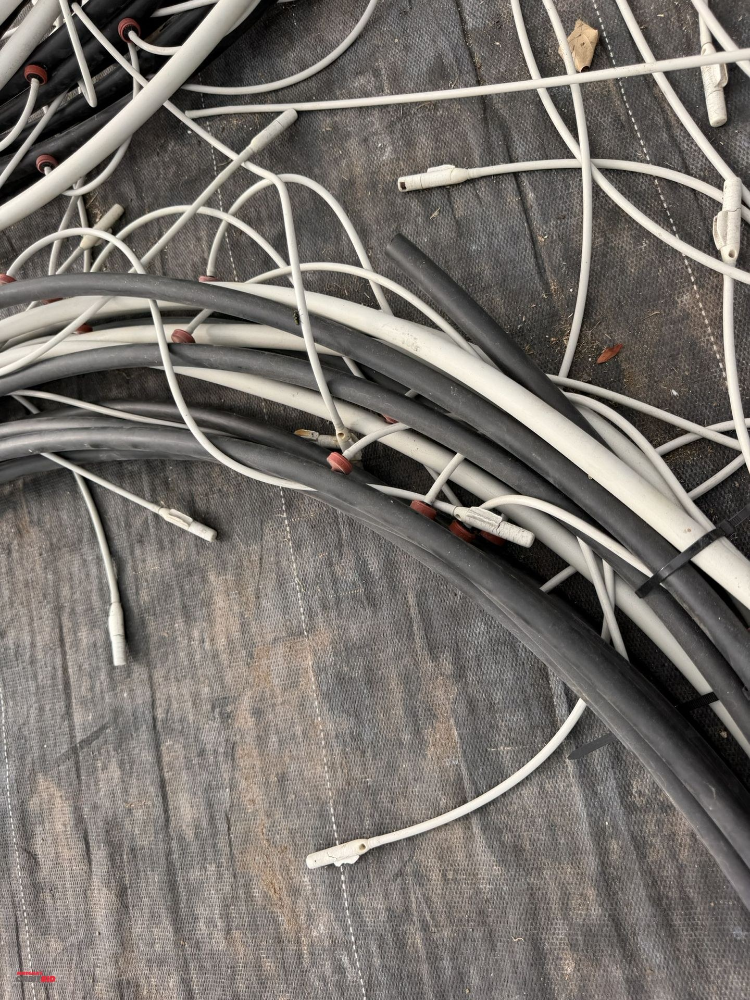
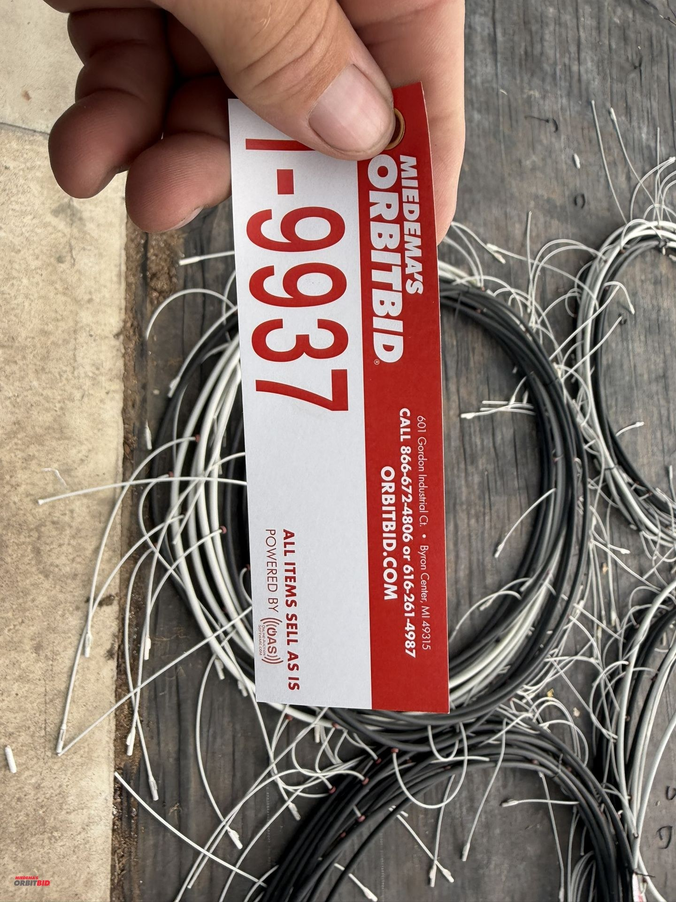

# Lot 9937

(2) Netafim 120' long piece of irrigation pipes with 20" on center drops.

- Snapshot bid: $5
- Bid count: 1
- Mirrored photos: 8

## Photo 1

[Original OrbitBid image](https://d1ljvnrgb7j023.cloudfront.net/files/1/75889529bf5b1d36621d/large)

## Photo 2

[Original OrbitBid image](https://d1ljvnrgb7j023.cloudfront.net/files/1/6520a11eb0d0e35d81e3/large)

## Photo 3

[Original OrbitBid image](https://d1ljvnrgb7j023.cloudfront.net/files/1/ad583a38b45076893f28/large)

## Photo 4

[Original OrbitBid image](https://d1ljvnrgb7j023.cloudfront.net/files/1/3b60a578d2539edba1b8/large)

## Photo 5

[Original OrbitBid image](https://d1ljvnrgb7j023.cloudfront.net/files/1/8102977c35d548915cb6/large)

## Photo 6

[Original OrbitBid image](https://d1ljvnrgb7j023.cloudfront.net/files/1/bc56c6c716afb27d8bda/large)

## Photo 7

[Original OrbitBid image](https://d1ljvnrgb7j023.cloudfront.net/files/1/1c0aebd0e12d6d3f1551/large)

## Photo 8

[Original OrbitBid image](https://d1ljvnrgb7j023.cloudfront.net/files/1/f883a5b78d2a2e767770/large)
