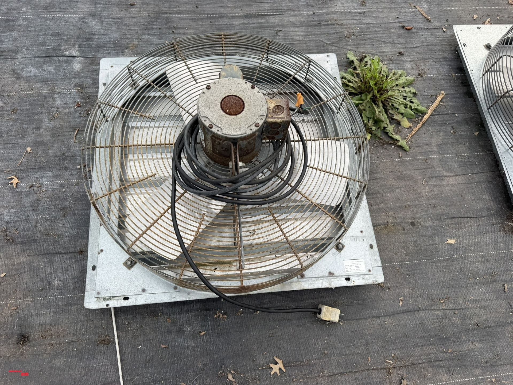
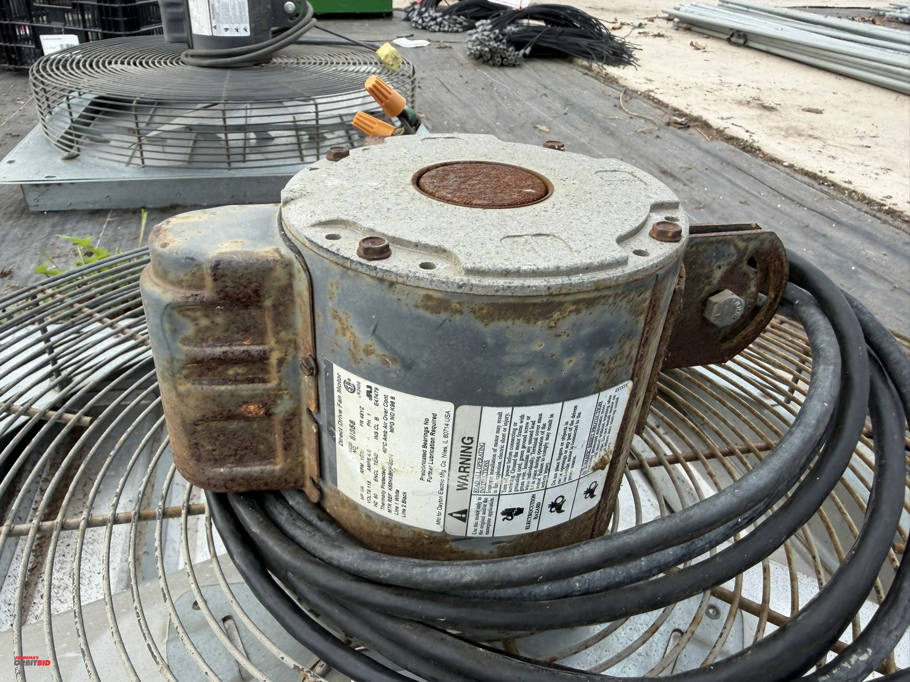
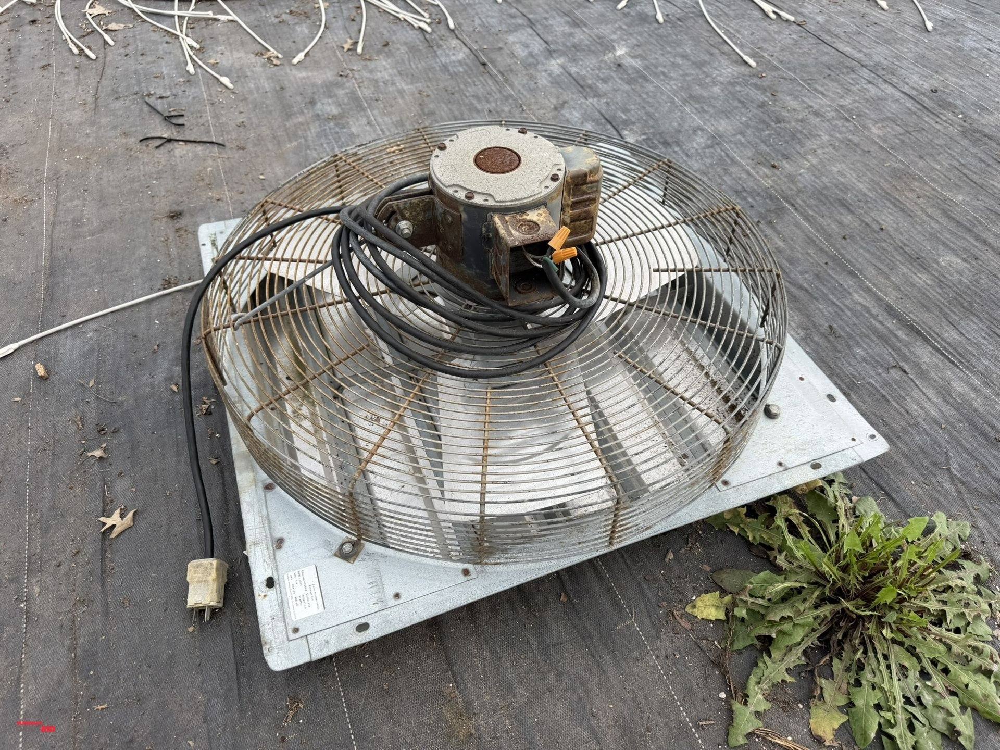
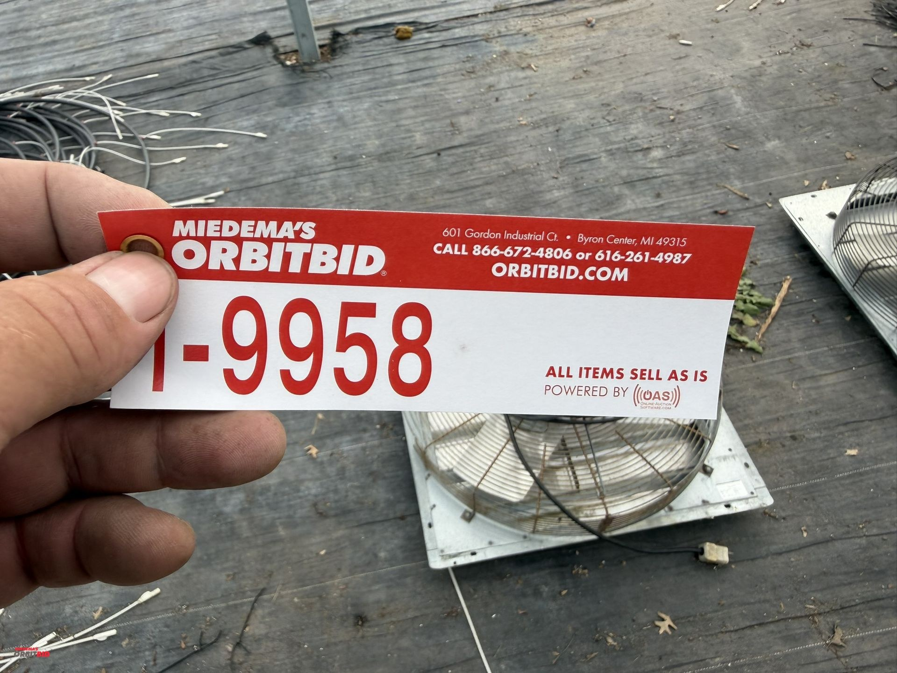

# Lot 9958

(1) Dayton 24" shutter-mounted exhaust fan, model 4C269B, 115V, 1/4 HP motor, in working condition.

- Snapshot bid: $45
- Bid count: 9
- Mirrored photos: 4

## Photo 1

[Original OrbitBid image](https://d1ljvnrgb7j023.cloudfront.net/files/1/dea56ea9329d1a52114c/large)

## Photo 2

[Original OrbitBid image](https://d1ljvnrgb7j023.cloudfront.net/files/1/7ef1d43f6cc72e78e017/large)

## Photo 3

[Original OrbitBid image](https://d1ljvnrgb7j023.cloudfront.net/files/1/9eab12447facd109e782/large)

## Photo 4

[Original OrbitBid image](https://d1ljvnrgb7j023.cloudfront.net/files/1/fceb264082b0409ce001/large)
