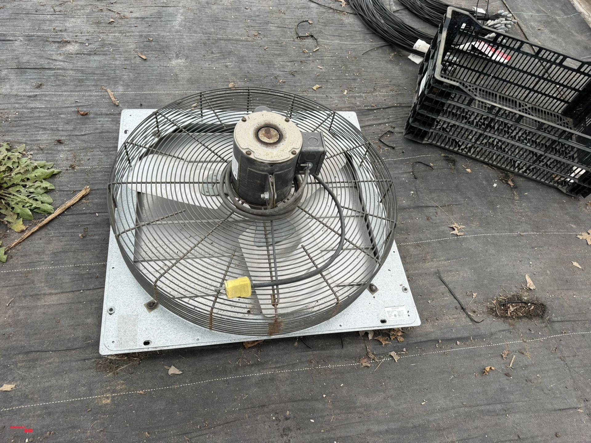
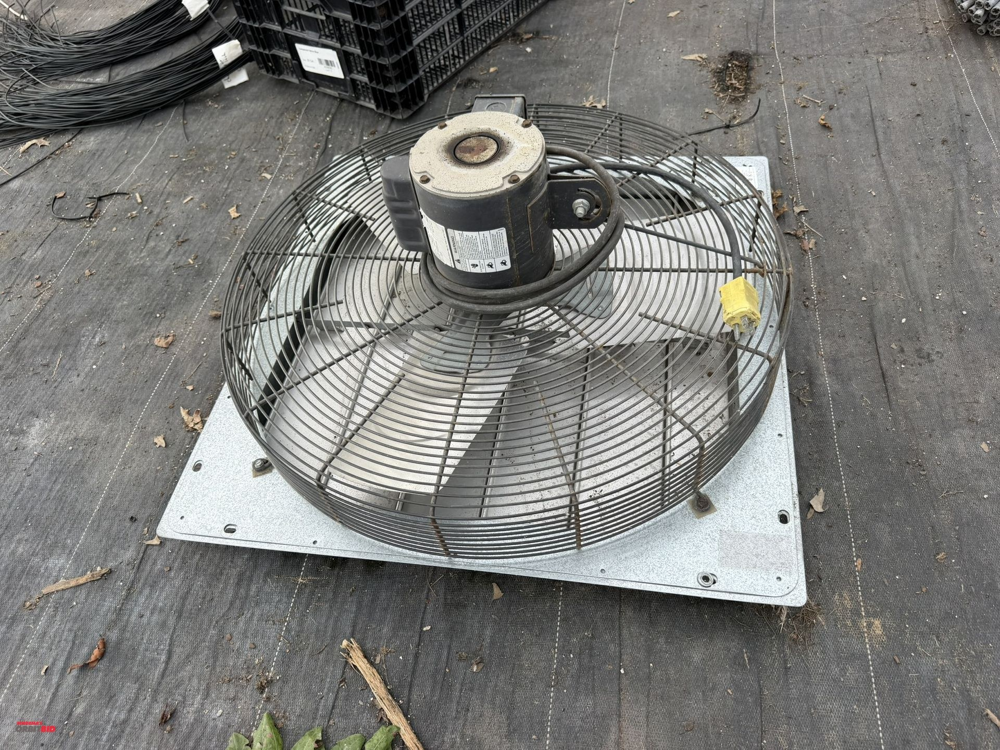
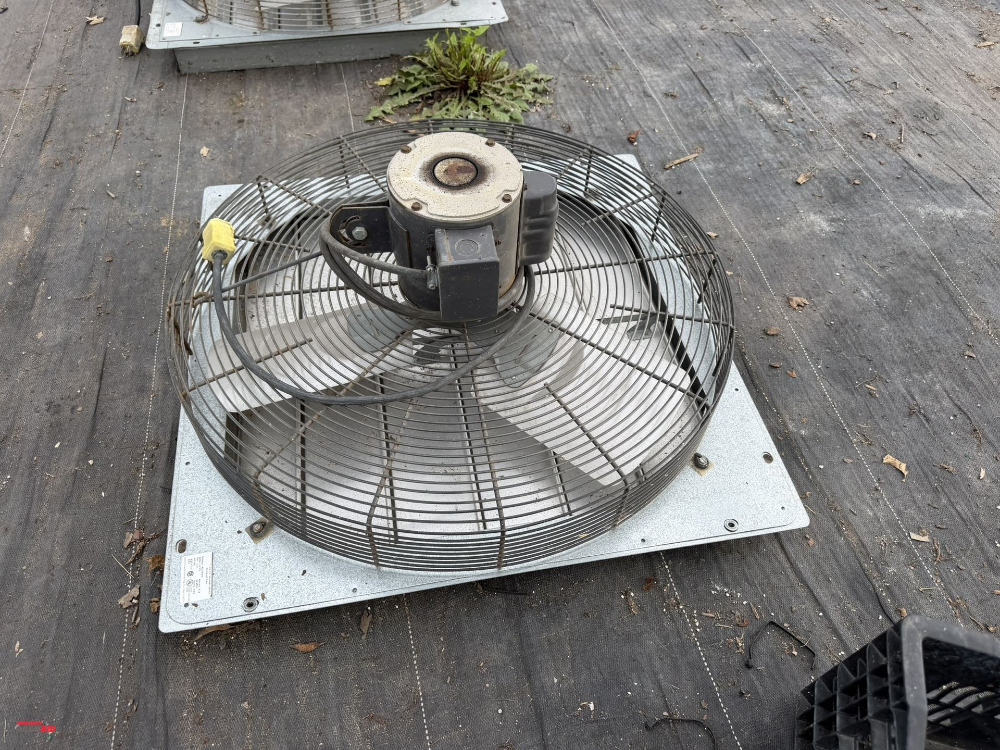
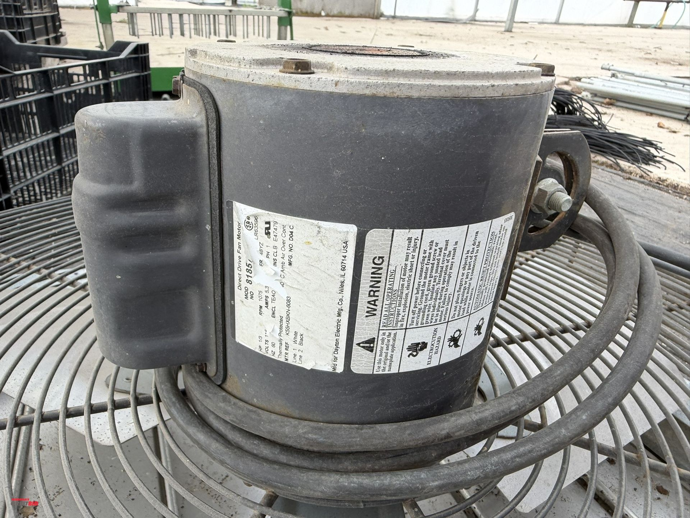
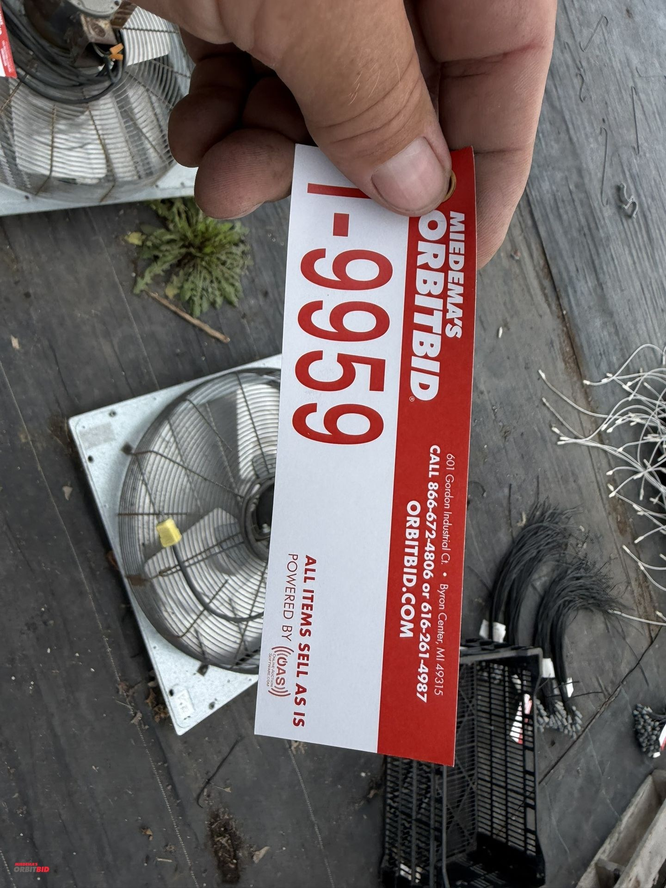

# Lot 9959

(1) Dayton 24" shutter-mounted exhaust fan, model 4C359A, 120V, 1/3 HP motor, in working condition.

- Snapshot bid: $50
- Bid count: 10
- Mirrored photos: 5

## Photo 1

[Original OrbitBid image](https://d1ljvnrgb7j023.cloudfront.net/files/1/839a3b0445b9b1f29c6a/large)

## Photo 2

[Original OrbitBid image](https://d1ljvnrgb7j023.cloudfront.net/files/1/7a765b3f0de945c81890/large)

## Photo 3

[Original OrbitBid image](https://d1ljvnrgb7j023.cloudfront.net/files/1/e24ca9c7b492963189ca/large)

## Photo 4

[Original OrbitBid image](https://d1ljvnrgb7j023.cloudfront.net/files/1/9575691ab477c176d4fb/large)

## Photo 5

[Original OrbitBid image](https://d1ljvnrgb7j023.cloudfront.net/files/1/6b9b80320b6b6c90bc97/large)
